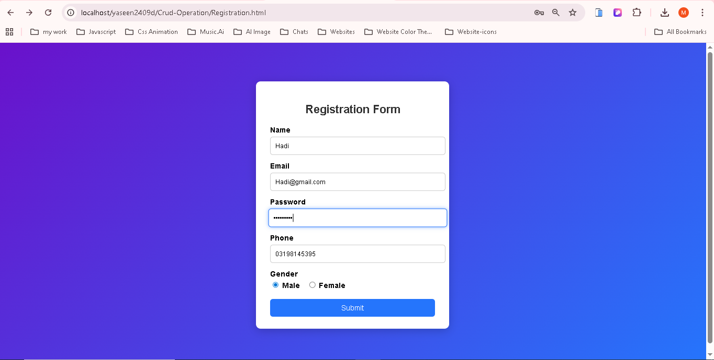
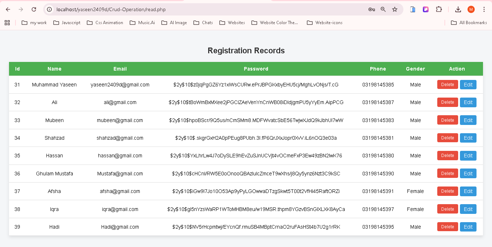
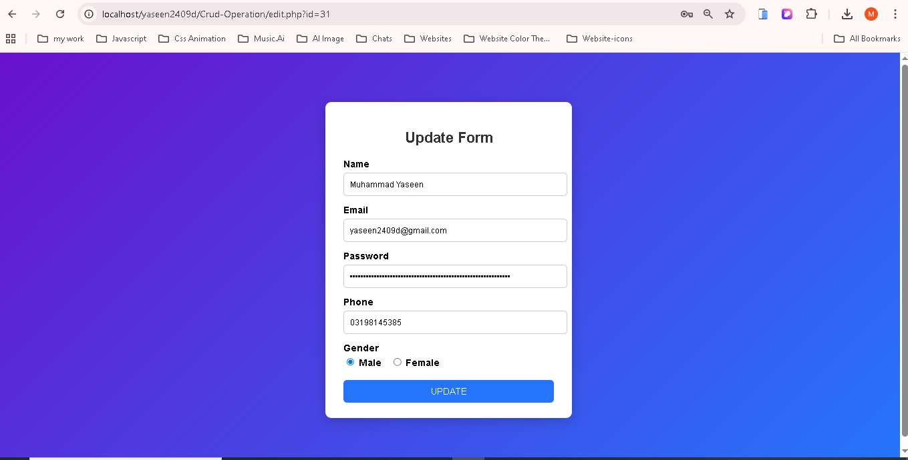

# 📋 PHP CRUD Operation Project


Ek simple aur beginner-friendly PHP application jo **Create, Read, Update, Delete (CRUD)** operations ko MySQL ke saath implement karta hai.  
Ye project PHP learners ke liye best example hai jo database ke saath kaam seekhna chahte hain.

---

## 📂 Project Structure

| File Name            | Description |
|----------------------|-------------|
| `Registration.html`  | User registration form (frontend) |
| `signup.php`         | Registration form ka data database me save karta hai |
| `read.php`           | Database se records fetch karke display karta hai |
| `edit.php`           | Existing record ko update karta hai |
| `style.css`          | Project ka styling file |
| `yaseen2409d.sql`    | Database export file |

---

## 🛠️ Tech Stack
- **PHP** – Backend logic
- **MySQL** – Database
- **HTML5 / CSS3** – Frontend design
- **XAMPP / WAMP** – Local server environment

---

## 📸 Screenshots

### 📝 Registration Form


### 📊 Records Table


### ✏️ Update Page



## 🚀 Setup Instructions

1. **Clone Repository**
   ```bash
   git clone https://github.com/CodeWithYaseen/Php-Crud-Operation.git
   cd Php-Crud-Operation
